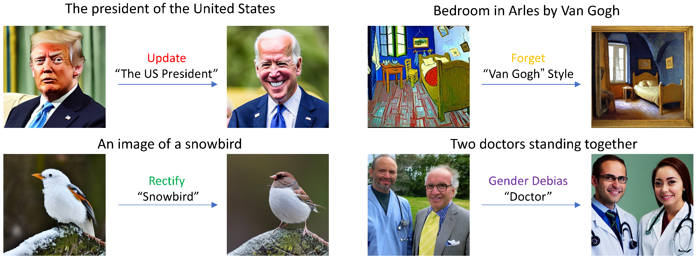
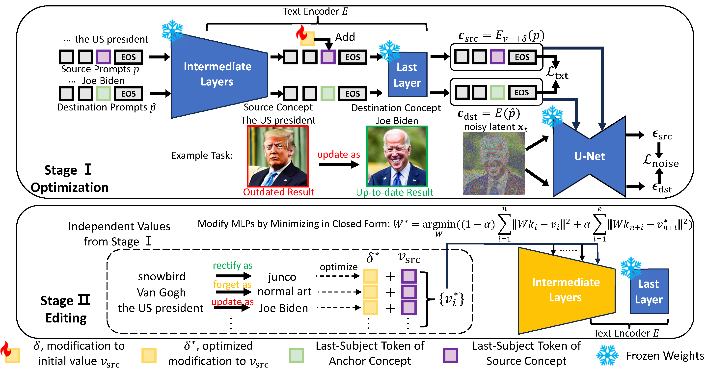

# Editing Massive Concepts in Text-to-Image Diffusion Models

#### [project page](https://SilentView.github.io/EMCID) | [arxiv](https://arxiv.org/abs/2403.13807)

<div align='center'>

</div>

Text-to-image diffusion models suffer from the risk of generating outdated, copyrighted, incorrect, and biased content. It is essential to handle them simultaneously in larger-scale real-world scenarios. We propose a two-stage method, Editing Massive Concepts In Diffusion Models (EMCID). The first stage performs memory optimization for each individual concept and the second stage conducts massive concept editing with multi-layer, closed form model editing.

We further propose a comprehensive benchmark, named ImageNet Concept Editing Benchmark (ICEB), for evaluating massive concept editing for T2I models with two subtasks, free-form prompts, massive concept categories, and extensive evaluation metrics.

Extensive experiments conducted on our proposed benchmark and previous benchmarks demonstrate the superior scalability of EMCID for editing up to 1,000 concepts, providing a practical approach for fast adjustment and re-deployment of T2I diffusion models in real-world applications.

<div align='center'>

</div>

## Installation

```
git clone https://github.com/SilentView/EMCID.git
cd ./EMCID
conda env create -f environment.yaml
```
### Calculate Pre-cached Statistics

To calculate pre-cached statistics, users need to first download the BLIP-2 CCS(filtered) captions [dataset](https://storage.googleapis.com/sfr-vision-language-research/BLIP/datasets/ccs_filtered.json), into `data/`

```shell
# export PYTHONPATH=.
# for sd-v1.4
python emcid/layer_stats.py --model_name=sd-text --device=YOUR_DEVICE

# for sd-xl
python emcid/layer_stats.py --model_name=sdxl-text1 --device=YOUR_DEVICE
python emcid/layer_stats.py --model_name=sdxl-text2 --device=YOUR_DEVICE
```

### (Optional)Prepare COCO-30k data

If users want to reproduce the experiments using COCO-30k, they need to prepare COCO-30k images.

We provide the `/data/coco/coco_30k.csv` annotation file, and users may obtain COCO-30k images from MSCOCO val2014 [link](http://images.cocodataset.org/zips/val2014.zip). Users can then use the util function `get_coco_30k_sub` in `/scripts/eval_coco.py` to get the COCO-30k subset.

### (Optional)Prepare ImageNet data

If users want to apply EMCID to rectify imprecise generation about ImageNet classes, and the T2I model cannot generate corresponding images at all, then users need to prepare ImageNet images as training data.

The data should be put in `/data/ImageNet/`. We use the validation set from [ImageNet](https://www.image-net.org/challenges/LSVRC/2012/).


## Training & Evaluation on Benchmarks
### AICE(Arbitrary ImageNet Concept Editing)
```shell
GPU_RANK=YOUR/GPU/RANK bash sh_scripts/AICE_test.sh 
```
This script will test EMCID on the task of AICE from our proposed benchmark ICEB. The script currently only support editing the Stable Diffusion v1.4 model.

Read the `sh_scripts/AICE_test.sh` for more parameter specification details.

The quantitative results will be saved in `results/emcid/HPARAM_NAME/imgnet_aug_summary.json`

### Concept Rectification
```shell
GPU_RANK=YOUR/GPU/RANK bash sh_scripts/rectification.sh 
```
This script will test EMCID on the task of Concept Rectification from our proposed benchmark ICEB. 

The quantitative results will be saved in `results/emcid/HPARAM_NAME/imgnet_mend_summary.json`


### Erasing Artist Styles 
```shell
GPU_RANK=YOUR/GPU/RANK bash sh_scripts/erase_artist.sh 
```
The quantitative results will be saved in `results/emcid/HPARAM_NAME/artists/`, and the generated images are stored in `data/artists/images/HPARAM_NAME/`.

Read the `sh_scripts/erase_artist.sh` for more parameter specification details.


### Gender Debiasing
```shell
# debias 37 professions simultaneously
GPU_RANK=YOUR/GPU/RANK bash sh_scripts/debias.sh multiple
```

The quantitative results will be saved in `results/emcid/HPARAM_NAME/debiasing/`

### RoAD and TIMED

[RoAD](https://github.com/technion-cs-nlp/ReFACT) and [TIMED](https://github.com/bahjat-kawar/time-diffusion) are two benchmarks mainly for single concept editing.

```shell
GPU_RANK=YOUR/GPU/RANK bash sh_scripts/road_test.sh 
GPU_RANK=YOUR/GPU/RANK bash sh_scripts/timed_test.sh 
```
The quantitative results will be saved in `results/emcid/HPARAM_NAME/`


## Examples

### Try Any Concept Editing

Users can try to edit `stable-diffusion-v1-4` checkpoint or  `stable-diffusion-xl-base-1.0` checkpoint with customized requests and hyperparameters. 

We provide example configurations in `test_examples` folder.

**Ex.1: To erase the artist style of Vincent van Gogh**:
```shell
# export PYTHONPATH=.
python scripts/run_emcid.py \
--instruction_path=test_examples/erasing_van_gogh_style.json \
--device=cuda:0
```

**Ex.2: To update the US president as Joe Biden for SD XL**:
```shell
# export PYTHONPATH=.
python scripts/run_emcid.py \
--instruction_path=test_examples/sdxl_us_president.json \
--device=cuda:0
```

*Note*:The hyperparameters for SDXL haven't been fully tuned. Users can try to tune them for better results.

## Citation
```
@article{xiong2024editing,
      title={Editing Massive Concepts in Text-to-Image Diffusion Models}, 
      author={Tianwei Xiong and Yue Wu and Enze Xie and Yue Wu and Zhenguo Li and Xihui Liu},
      year={2024},
      journal={arXiv preprint arXiv:2403.13807}
}
```


<!-- To plot the results for layer ablation:
```
python experiments/ablation.py --plot_layer_ablation
```

```
python experiments/ablation.py --plot_num_edit_token_ablation
```


To reproduce the erasing of Van Gogh style:
```
python scripts/visual_examples.py --hparam=dest_s-200_c-1.5_ly-7-11_lr-
0.2_wd-5e-04_txt-align-0.01 --van_gogh --mom2_weight=4000 --device=cuda:1
``` -->